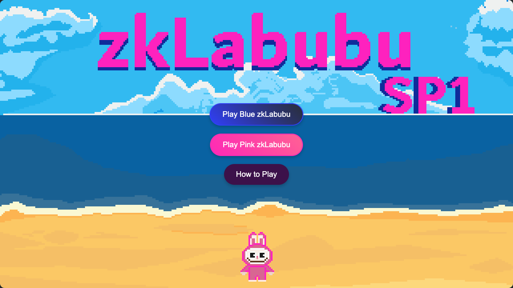
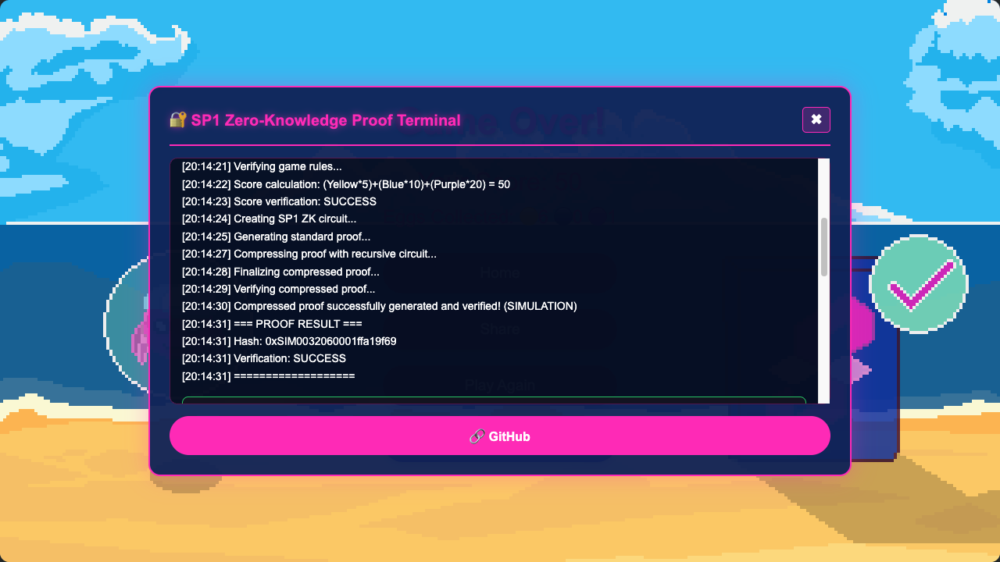
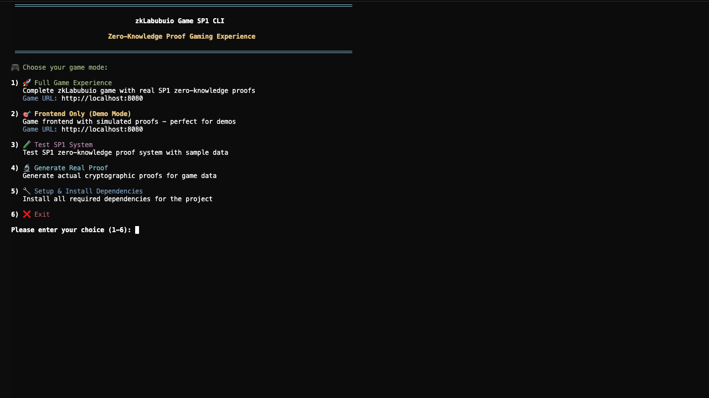

# zkLabubuio Game - SP1

zkLabubu game with SP1 ZK proof integration.



##  Play

### Simulation Mode
**[Play zkLabubu SP1](https://zklabubu.vercel.app)**



- Simulates ZK proof generation

### 🔬 Real ZK Proofs (Local Setup)

For actual cryptographic proof generation:



```bash
npm run quick-start
```

##  Features

- **Labubu arcade game** with WebAssembly
-  **Team selection**: Blue vs Pink zkLabubu characters
- **Collect eggs**: Yellow (5pts), Blue (10pts), Purple (20pts)
- **SP1 zero-knowledge proofs** for cryptographic score verification
- **Power-ups**: Shield, Double Points, Extra Life, Slowdown
- **Progressive difficulty** system

## 🛠️ SP1 Setup (For Real Proofs)

To generate actual zero-knowledge proofs, you need SP1 installed:

### Quick SP1 Installation
```bash
# Install SP1 toolchain
curl -L https://sp1up.succinct.xyz | bash
sp1up

# Verify installation
cargo prove --version
```

##  One-Command Setup

```bash
git clone https://github.com/d3lta02/zklabubu-sp1.git
cd zklabubu-sp1
npm run quick-start
```

##  Game Modes

1. **Full Experience** - Real ZK proofs (requires SP1 setup)
2. **Simulation Mode** - Simulated proofs
3. **Test SP1** - Verify ZK proof system
4. **Generate Proof** - Create cryptographic proofs


##  Project Structure

```
zklabubu-sp1/
├──  zklabubu_game/           # WASM Game Engine
├──  zklabubu_proof/          # SP1 ZK Proof System  
├──  backend/                 # SP1 Backend API
├──  run-zklabubuio.sh        # Interactive CLI

```

##  How ZK Proofs Work

1. **Play** the game and collect eggs
2. **Generate proof** after game over
3. **Cryptographic verification** that your score follows game rules
4. **Tamper-proof results** verifiable by anyone

**Local (Real Proofs)**
```bash
npm run quick-start
```

---

 **Play zkLabubu Game!** | **Experience ZK Proofs!**